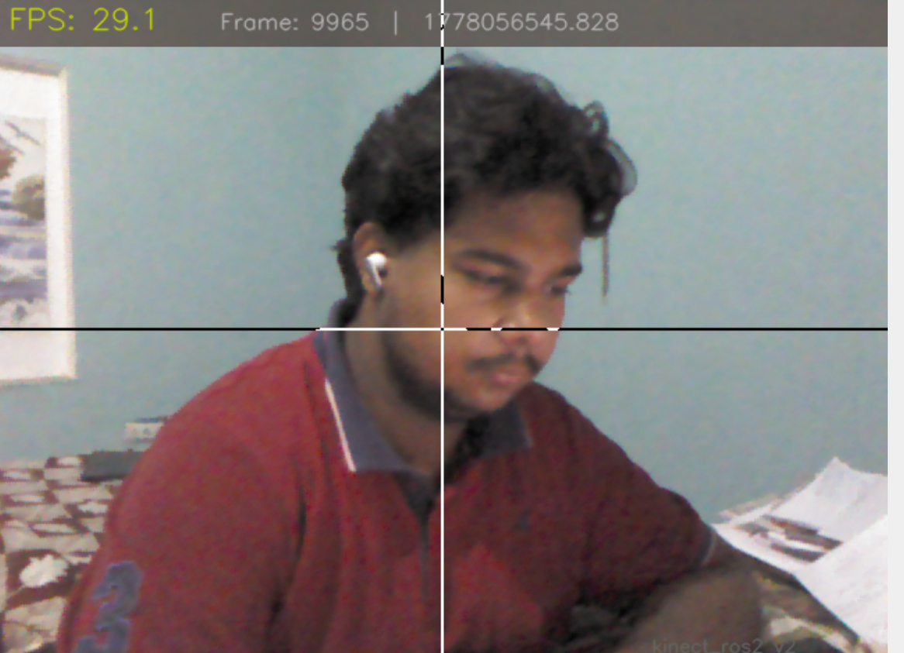
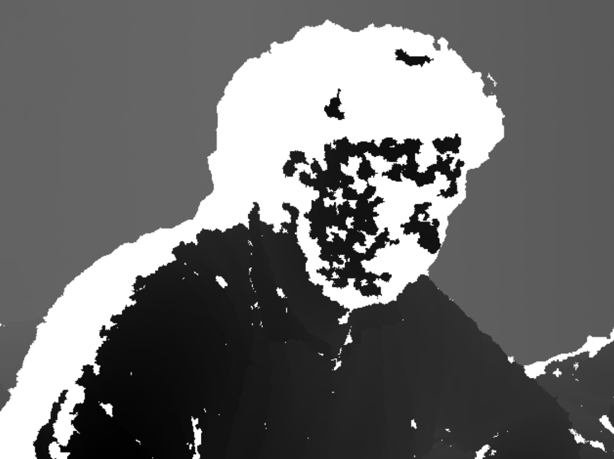
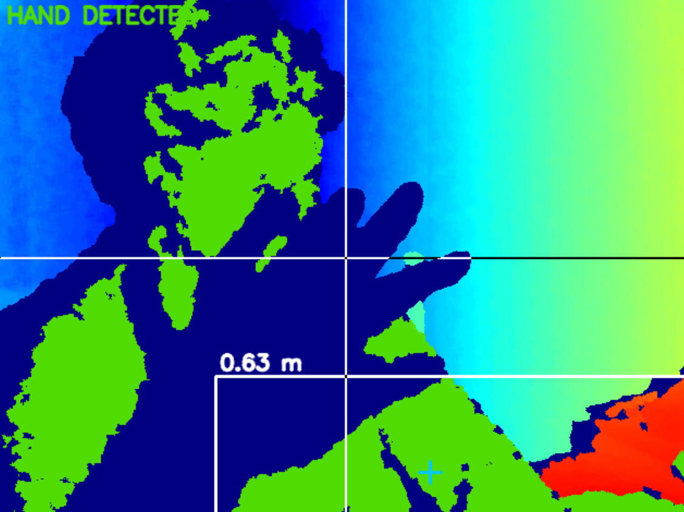
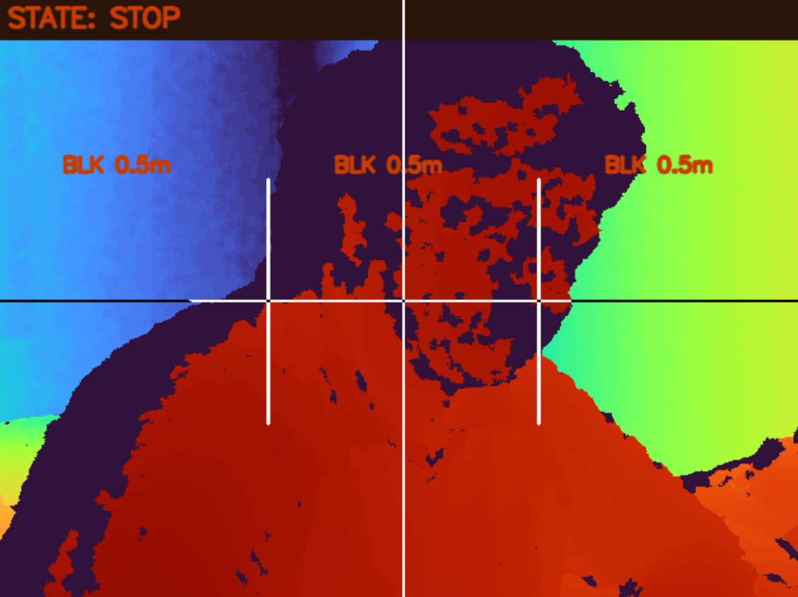
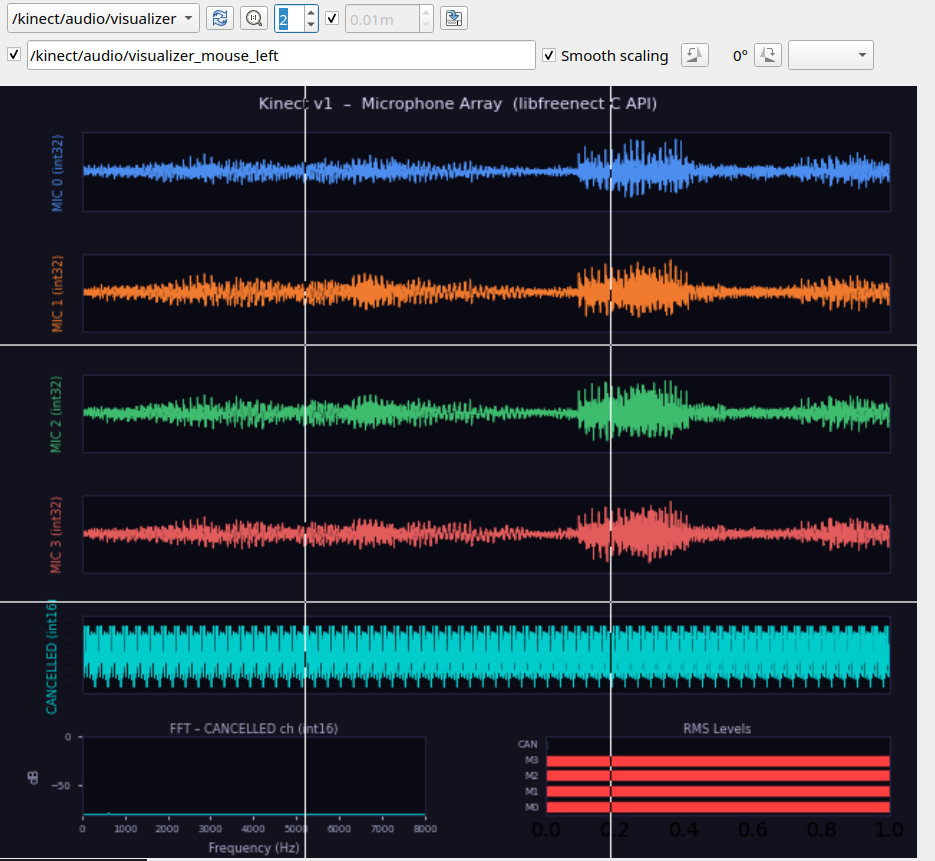
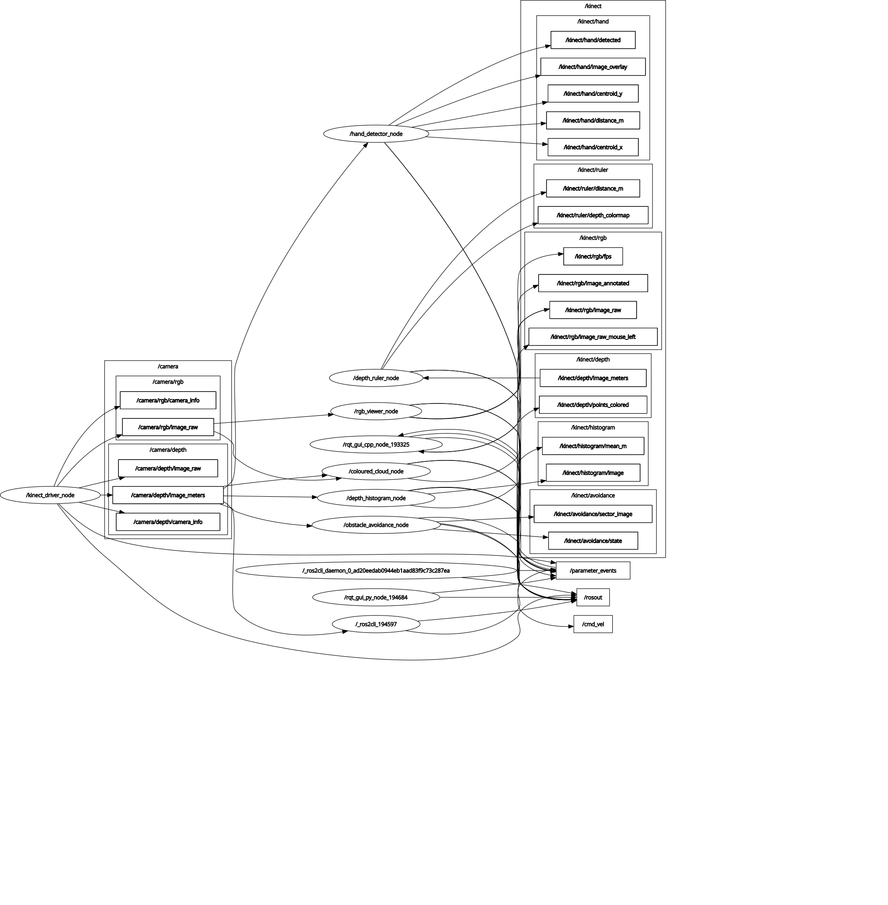

# kinect_ros2

### A native ROS 2 Jazzy driver ecosystem for the Microsoft Kinect v1 (Xbox 360)

[](https://opensource.org/licenses/Apache-2.0)
[](https://docs.ros.org/en/jazzy)
[](https://ubuntu.com/)
[](https://python.org)

Fifteen years after its Xbox debut, the Kinect v1 is still one of the cheapest ways to get synchronized RGB, depth, a 4-mic array, and a tilt/accelerometer stack on a robot. `kinect_ros2` wraps `libfreenect` in a clean set of ROS 2 nodes — a core driver plus a growing set of example nodes for depth analysis, hand/blob tracking, sensor fusion, audio processing, and Nav2/SLAM integration.

---

## 📸 See It Running

Everything below was captured from `rqt` and RViz while the full node graph was live.

| RGB Feed | Depth (Grayscale) | Depth Histogram |
|:---:|:---:|:---:|
|  |  |  |
| Live `/camera/rgb/image_raw` | Raw disparity rendered as grayscale | Real-time depth-value distribution |

| Hand Detection | Object Tracking |
|:---:|:---:|
|  |  |
| Blob mask + centroid on depth | Tracked target across frames |

| 4-Channel Mic Array (Raw) |
|:---:|
|  |
| Individual waveform per microphone |

> Drop your own screenshots into `docs/screenshots/` using the filenames above and this table will render them automatically on GitHub.

### System Node Graph (rqt_graph, all nodes running)



This is the actual `rqt_graph` output with the driver, vision examples, audio pipeline, and navigation stack all spun up together — the real topology behind the tables below.

---

## What This Package Gives You

| Capability | Nodes Involved |
|---|---|
| **RGB + Depth acquisition** | `kinect_driver` |
| **Tilt motor & accelerometer control** | `tilt_control`, `kinect_accel`, `kinect_audio_cpp/kinect_tilt_accel_node` |
| **Depth-based vision examples** | `ex01_rgb_viewer` → `ex06_obstacle_avoidance`, `ex10_tilt_demo` |
| **4-Mic array capture & audio pipeline** | `kinect_audio`, `kinect_audio_cpp/kinect_audio_node`, `ex08_mic_visualizer`, `ex09_speech_recognition` |
| **2D LaserScan conversion** | `depth_to_laserscan` |
| **Nav2 / SLAM integration** | `fake_odom`, `nav2_kinect.launch.py`, `slam_params.yaml`, `nav2_params.yaml` |
| **End-to-end robot demo** | `waiter_robot` |

The driver alone is enough for basic RGB-D work; the examples layer on top of it to demonstrate specific patterns (annotation, fusion, control, audio, navigation) without ever touching the USB device directly.

---

## Repository Layout

```
kinect_ros2/
├── kinect_ros2/                    # Python package
│   ├── kinect_driver_node.py       # Core RGB/Depth/CameraInfo publisher
│   ├── kinect_device.py            # KinectDevice context-manager API (libfreenect wrapper)
│   ├── depth_alert_node.py         # ROI proximity classifier
│   ├── depth_to_laserscan_node.py  # Depth → 2D LaserScan
│   ├── depth_utils.py              # Disparity↔metres conversion, ROI helpers
│   ├── tilt_control_node.py        # Tilt motor + accelerometer control
│   ├── kinect_accel_node.py        # Standalone accelerometer publisher
│   ├── kinect_audio_node.py        # Mic-array audio publisher (Python)
│   ├── fake_odom_node.py           # Synthetic odometry for SLAM without wheel encoders
│   ├── waiter_robot_node.py        # Full demo: navigation + obstacle avoidance
│   └── examples/
│       ├── ex01_rgb_viewer/            # RGB annotation + FPS overlay
│       ├── ex02_depth_ruler/           # Nearest-object distance via percentile ROI
│       ├── ex03_depth_histogram/       # Depth distribution visualizer
│       ├── ex04_hand_detector/         # Blob/hand proximity detector
│       ├── ex05_coloured_cloud/        # RGB + depth → XYZRGB point cloud
│       ├── ex06_obstacle_avoidance/    # Sector-based avoidance state machine
│       ├── ex07_accel_monitor/         # Accelerometer visualization
│       ├── ex08_mic_visualizer/        # Live 4-channel mic array + filtered plot
│       ├── ex09_speech_recognition/    # Speech recognition on filtered audio
│       └── ex10_tilt_demo/             # Tilt motor demo sequence
│
├── kinect_audio_cpp/                # C++ package: low-level audio + tilt/accel node
│   ├── src/kinect_audio_node.cpp
│   └── src/kinect_tilt_accel_node.cpp
│
├── config/
│   ├── kinect_params.yaml           # Driver parameters
│   ├── examples_params.yaml         # Shared parameters for all example nodes
│   ├── kinect.rviz                  # RViz config: RGB, depth, point cloud
│   ├── nav2_kinect.rviz             # RViz config: Nav2 stack
│   ├── nav2_params.yaml             # Nav2 stack parameters
│   └── slam_params.yaml             # SLAM Toolbox parameters
│
├── launch/
│   ├── kinect.launch.py             # Driver only
│   ├── kinect_full.launch.py        # Driver + alert + tilt + laserscan
│   ├── kinect_rviz.launch.py        # Full stack + RViz
│   ├── kinect_audio.launch.py       # Audio pipeline
│   ├── kinect_all_examples.launch.py # Driver + all vision/audio examples
│   └── nav2_kinect.launch.py        # Driver + fake_odom + Nav2 + SLAM
│
├── test/                            # flake8, pep257, copyright tests
├── docs/
│   ├── images/rqt_graph.svg         # Node graph (this README's diagram)
│   └── screenshots/                 # Your captures go here (see gallery above)
├── package.xml
├── setup.py / setup.cfg
└── LICENSE
```

---

## Core Driver: `kinect_driver_node`

Publishes synchronized RGB and depth straight off the sensor via `libfreenect`.

| Topic | Type | Notes |
|---|---|---|
| `/camera/rgb/image_raw` | `sensor_msgs/Image` (`rgb8`) | 640×480 @ 30 Hz |
| `/camera/rgb/camera_info` | `sensor_msgs/CameraInfo` | fx/fy ≈ 525 px |
| `/camera/depth/image_raw` | `sensor_msgs/Image` (`16UC1`) | Raw 11-bit disparity, 0–2047 |
| `/camera/depth/image_meters` | `sensor_msgs/Image` (`32FC1`) | Metric depth, ~0.4–5.0 m |
| `/camera/depth/camera_info` | `sensor_msgs/CameraInfo` | Depth intrinsics |

**Depth conversion** (raw disparity `r` → metres `d`):

$$d = \frac{1}{(r \cdot C_1) + C_2}, \quad C_1 = -0.0030711016,\ C_2 = 3.3309495161$$

QoS is `BEST_EFFORT`; any subscriber consuming these topics directly must match that reliability setting.

---

## The Example Nodes

All example nodes **subscribe to driver topics** — none of them touch the Kinect's USB interface directly, which is what lets the whole graph in the screenshot above run concurrently without `LIBUSB_ERROR_BUSY` conflicts.

| # | Node | What it does |
|---|---|---|
| 01 | `rgb_viewer` | Adds an FPS counter/timestamp overlay to the RGB stream |
| 02 | `depth_ruler` | Reports nearest-object distance from a configurable central ROI (percentile-based) |
| 03 | `depth_histogram` | Buckets and plots the depth-value distribution across the frame — this is the graph in the gallery above |
| 04 | `hand_detector` | Thresholds near-field depth, finds the largest blob, publishes centroid + distance |
| 05 | `coloured_cloud` | Time-synchronizes RGB + depth and back-projects to an XYZRGB point cloud |
| 06 | `obstacle_avoidance` | Splits the depth frame into left/centre/right sectors and drives a `FORWARD / TURN_LEFT / TURN_RIGHT / STOP` state machine |
| 07 | `accel_monitor` | Visualizes live accelerometer output |
| 08 | `mic_visualizer` | Plots all four raw mic-array channels plus the final filtered/merged signal |
| 09 | `speech_recognition` | Runs recognition on the filtered audio from `ex08` |
| 10 | `tilt_demo` | Runs the tilt motor through a demo sweep, useful for verifying motor + accel wiring |

Example parameters live centrally in `config/examples_params.yaml`, loaded automatically by the launch files — no need to edit each node's source to retune thresholds.

---

## Audio Pipeline (4-Mic Array)

The Kinect's 4-microphone array is exposed through two layers:

1. **`kinect_audio_cpp`** — a C++ package handling raw multi-channel capture (`kinect_audio_node.cpp`) and combined tilt/accel telemetry (`kinect_tilt_accel_node.cpp`), for the lowest-latency path.
2. **`kinect_audio_node.py` / `ex08_mic_visualizer` / `ex09_speech_recognition`** — Python-side consumers that visualize each of the four channels individually, apply filtering/beamforming, and feed the merged result into speech recognition.

Launch the audio stack on its own with:

```bash
ros2 launch kinect_ros2 kinect_audio.launch.py
```

---

## Navigation & SLAM

For robots that don't have wheel encoders, `fake_odom_node` synthesizes odometry so the Nav2 stack has something to work with, paired with `depth_to_laserscan` to give Nav2/SLAM Toolbox a 2D scan from the depth stream.

```bash
ros2 launch kinect_ros2 nav2_kinect.launch.py
```

This brings up: driver → `depth_to_laserscan` → `fake_odom` → SLAM Toolbox (`slam_params.yaml`) → Nav2 (`nav2_params.yaml`), visualized with `config/nav2_kinect.rviz`.

The `waiter_robot_node` demo builds on this stack end-to-end: navigation + obstacle avoidance combined into a single serving-robot behaviour, as a reference for anyone building a full application rather than individual nodes.

---

## Installation

### 1. System dependencies

```bash
sudo apt update && sudo apt install -y \
  build-essential cmake git pkg-config \
  libusb-1.0-0-dev libusb-dev \
  libopencv-dev python3-dev python3-pip libudev-dev
```

### 2. Build `libfreenect` from source (Python bindings enabled)

```bash
git clone https://github.com/OpenKinect/libfreenect.git ~/libfreenect
cd ~/libfreenect && mkdir build && cd build
cmake .. -DBUILD_PYTHON=ON -DCMAKE_INSTALL_PREFIX=/usr/local
make -j$(nproc) && sudo make install && sudo ldconfig
pip3 install freenect
```

### 3. udev rules (non-root USB access)

```bash
sudo cp ~/libfreenect/platform/linux/udev/51-kinect.rules /etc/udev/rules.d/
sudo udevadm control --reload-rules && sudo udevadm trigger
sudo usermod -aG video $USER   # log out/in (or `newgrp video`) to apply
```

### 4. ROS 2 package dependencies

```bash
sudo apt install -y \
  ros-jazzy-cv-bridge ros-jazzy-depthimage-to-laserscan ros-jazzy-rviz2 \
  ros-jazzy-image-transport ros-jazzy-tf2-ros ros-jazzy-tf2-geometry-msgs \
  ros-jazzy-nav2-bringup ros-jazzy-slam-toolbox
pip3 install opencv-python numpy scipy message_filters SpeechRecognition
```

### 5. Build the workspace

```bash
mkdir -p ~/ros2_ws/src && cd ~/ros2_ws/src
git clone https://github.com/JaideepChouhan/kinect_ros2.git
cd ~/ros2_ws && colcon build --symlink-install
source install/setup.bash
```

**Verify:**
```bash
lsusb | grep -i kinect
ros2 pkg executables kinect_ros2
```

---

## Running

```bash
# Driver only
ros2 launch kinect_ros2 kinect.launch.py

# Driver + alert + tilt + laserscan
ros2 launch kinect_ros2 kinect_full.launch.py

# Full stack + RViz
ros2 launch kinect_ros2 kinect_rviz.launch.py

# Every vision/audio example at once
ros2 launch kinect_ros2 kinect_all_examples.launch.py

# Audio pipeline only
ros2 launch kinect_ros2 kinect_audio.launch.py

# Navigation + SLAM
ros2 launch kinect_ros2 nav2_kinect.launch.py
```

Run any single example directly once the driver is up:

```bash
ros2 run kinect_ros2 ex04_hand_detector
ros2 run kinect_ros2 ex08_mic_visualizer
```

---

## Troubleshooting

| Issue | Fix |
|---|---|
| `ModuleNotFoundError: freenect` | Rebuild `libfreenect` with `-DBUILD_PYTHON=ON`, confirm with `python3 -c "import freenect"` |
| `LIBUSB_ERROR_BUSY` | Only `kinect_driver_node` should open the device — check no other process is also polling libfreenect |
| Permission denied on USB | Re-apply udev rules, confirm group: `id -G \| grep video` |
| Depth topics silent, RGB fine | Check `publish_depth:=true` and confirm QoS `BEST_EFFORT` on your subscriber |
| Mic visualizer shows flatline | Confirm `kinect_audio_cpp` node is running — Python audio node depends on its output topic |

---

## Contributing

1. Fork → feature branch → `colcon test --packages-select kinect_ros2`
2. Follow PEP 8 (flake8-enforced) and PEP 257 docstrings
3. Open a PR describing the change and motivation

Bug reports and feature requests: [GitHub Issues](https://github.com/JaideepChouhan/kinect_ros2/issues)

---

## Acknowledgements

- [OpenKinect / libfreenect](https://github.com/OpenKinect/libfreenect) — the reverse-engineered driver this package builds on
- The ROS 2 community, for the Jazzy middleware and tooling this integrates with

## Maintainer

**Jaideep Chouhan** · jaideepchouhan123@gmail.com
Repo: https://github.com/JaideepChouhan/kinect_ros2 · Issues: https://github.com/JaideepChouhan/kinect_ros2/issues

---

## License

Apache 2.0 — see [LICENSE](LICENSE).
